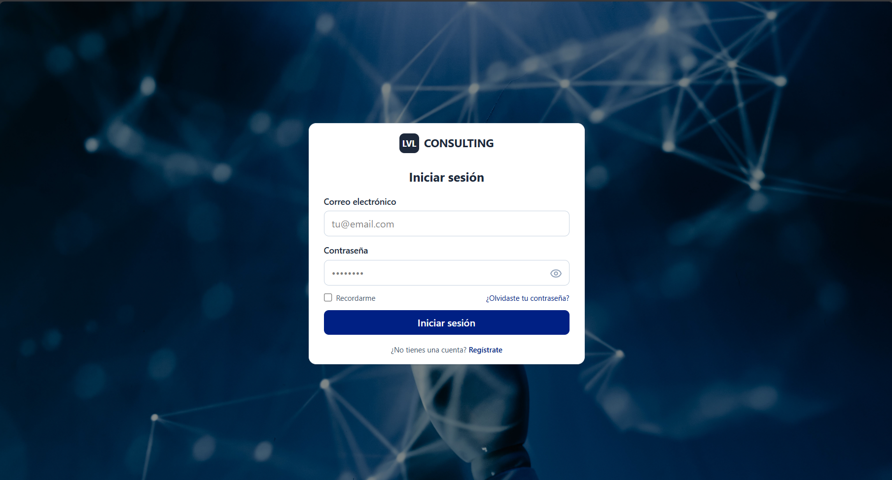
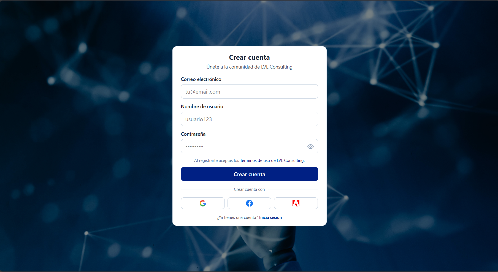
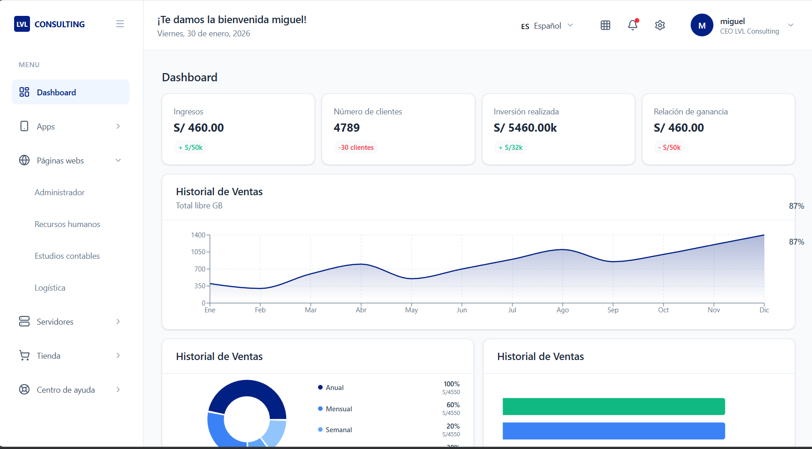
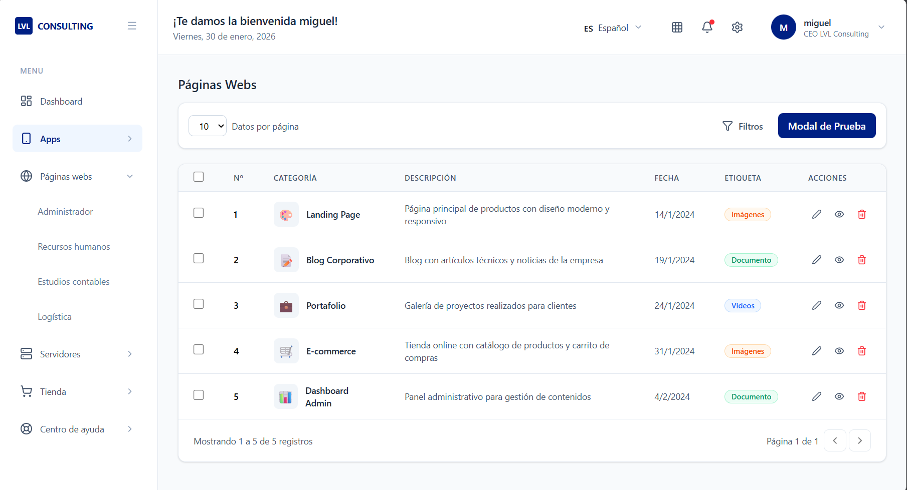
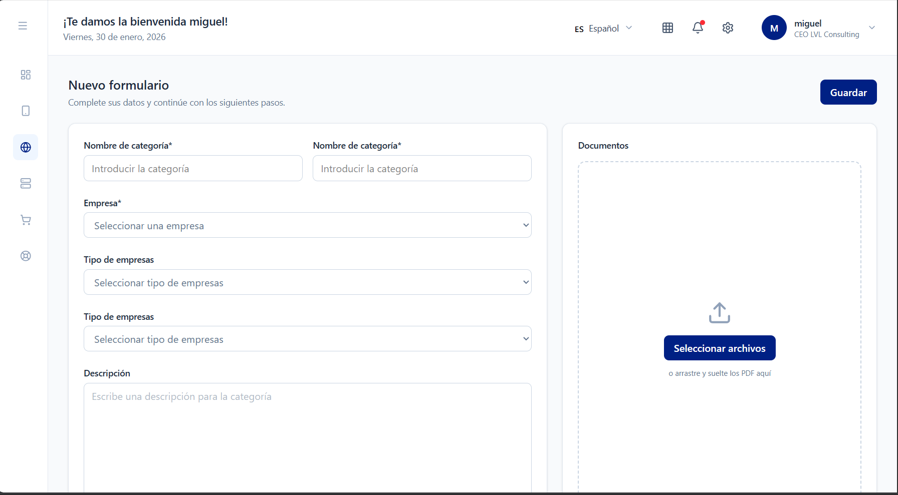
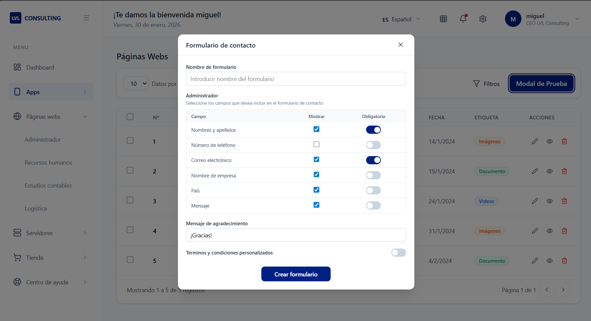

# LVL Consulting Dashboard

Dashboard administrativo moderno para LVL Consulting con autenticación, gestión de productos, páginas web y más.

## Capturas de Pantalla

### Login


### Registro


### Dashboard Principal


### Gestión de Páginas Web


### Formulario de Administración


### Modal


## Instalación

```bash
npm install
```

## Ejecución 

```bash
npm run dev
```

Abre [http://localhost:5173](http://localhost:5173) en tu navegador.

## Credenciales de prueba

Puedes iniciar sesión con cualquiera de estos usuarios:

- **Usuario:** miguel@lvlconsulting.com
- **Usuario:** admin@lvlconsulting.com

(Funcioa con cualquier contraseña para el login de prueba, son datos estaticos pero si
se necesita loguearse para entrar a las demás vistas)

## Mejoras: 
Crear los servicios faltantes para estar preparado para un backend.Y mejorar la estructura de carpetas para que sea más claro.

## Dificultades:
Algunos gráficos no pude replicar al 100%, algunos tienen datos estáticos como las tablas y gráficos
